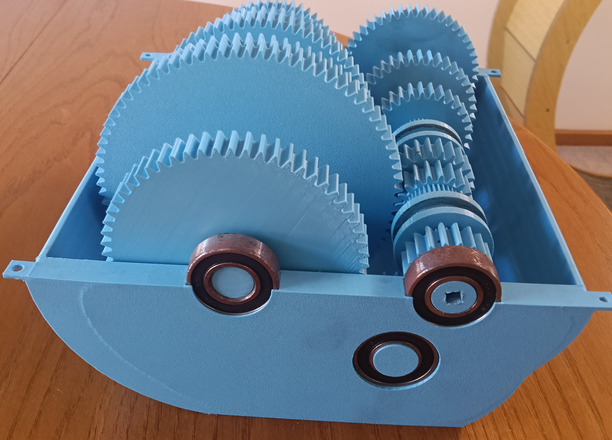
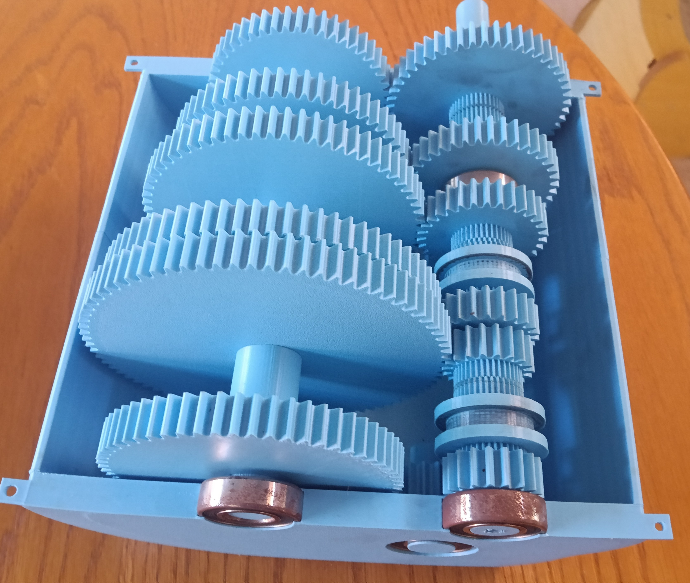
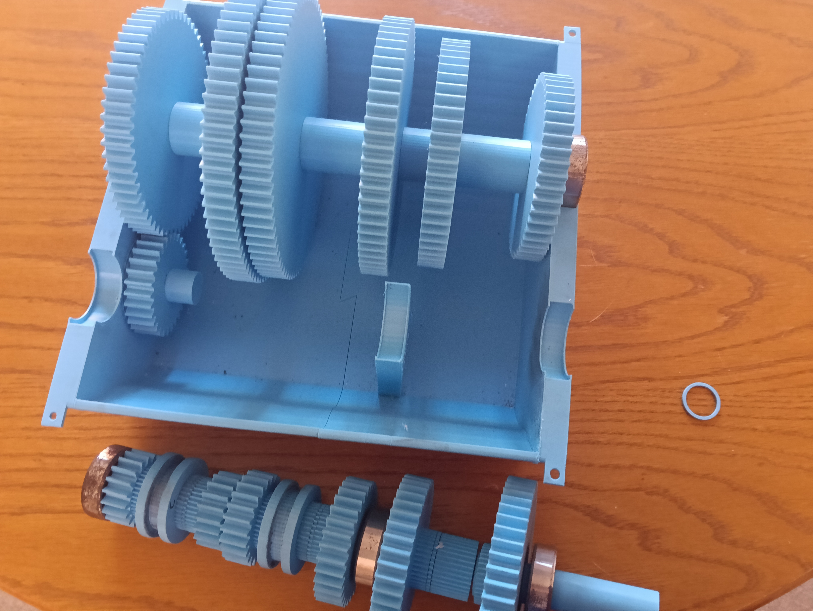

## Physical Prototype

  

<em>Assembled gearbox with the internal spur-gear system exposed.</em>

  
  

  
  

  

<em>Partial disassembly showing the compound selector shaft and internal casing layout.</em>

