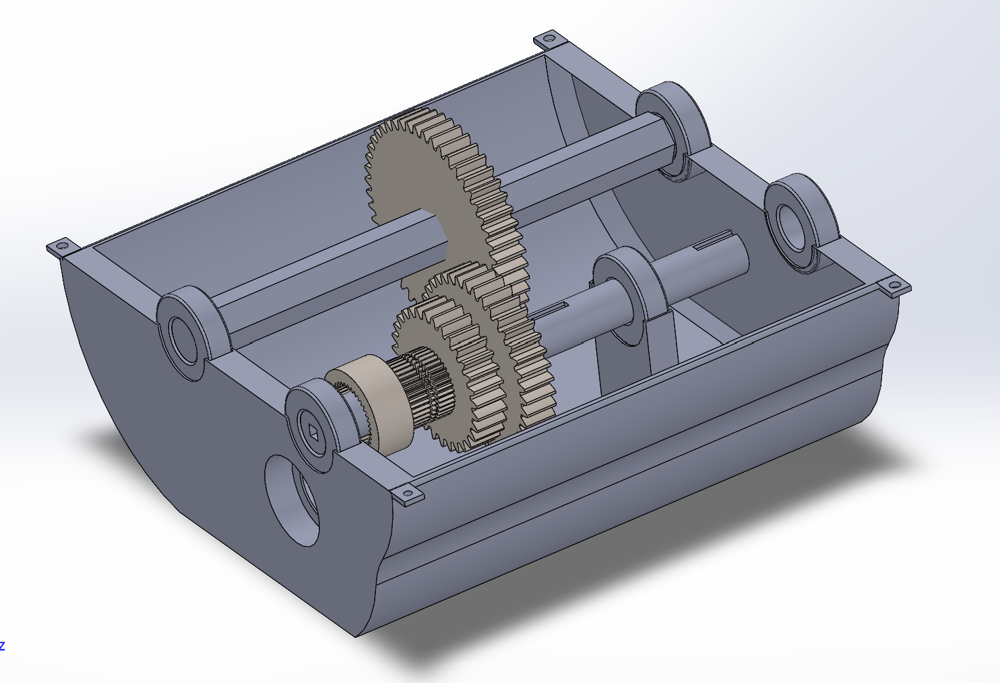
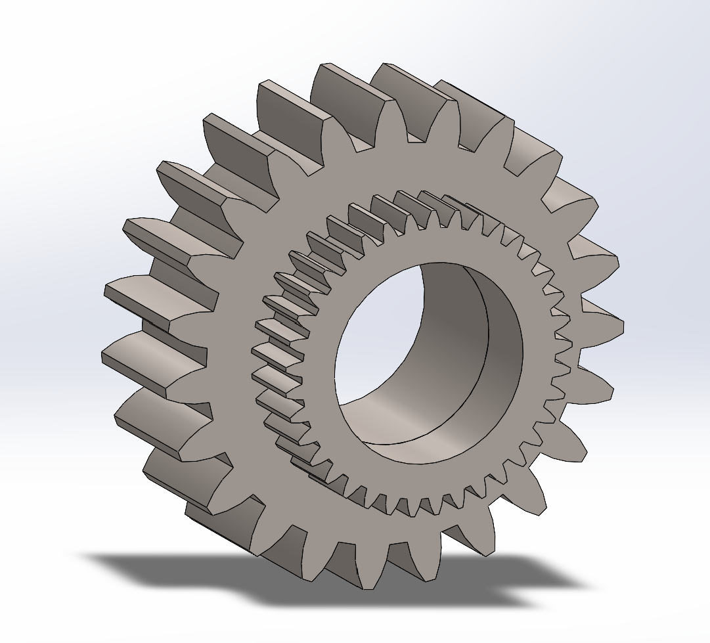
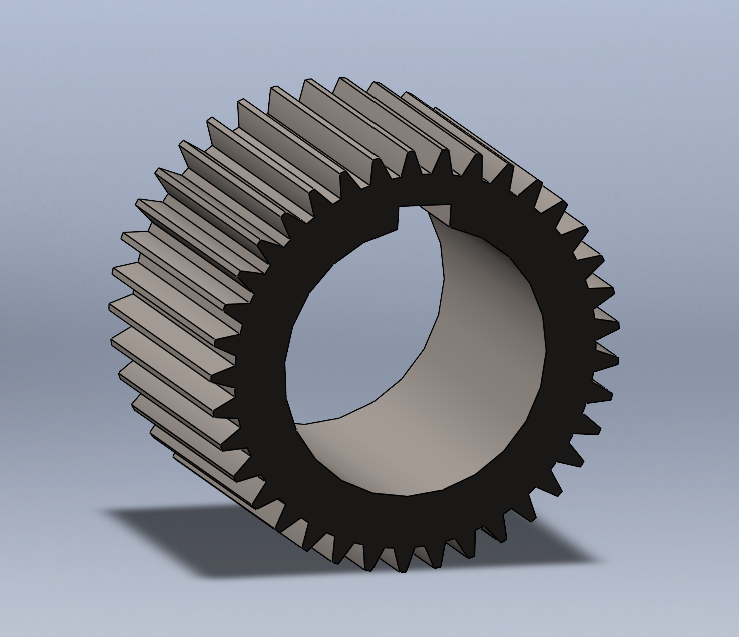
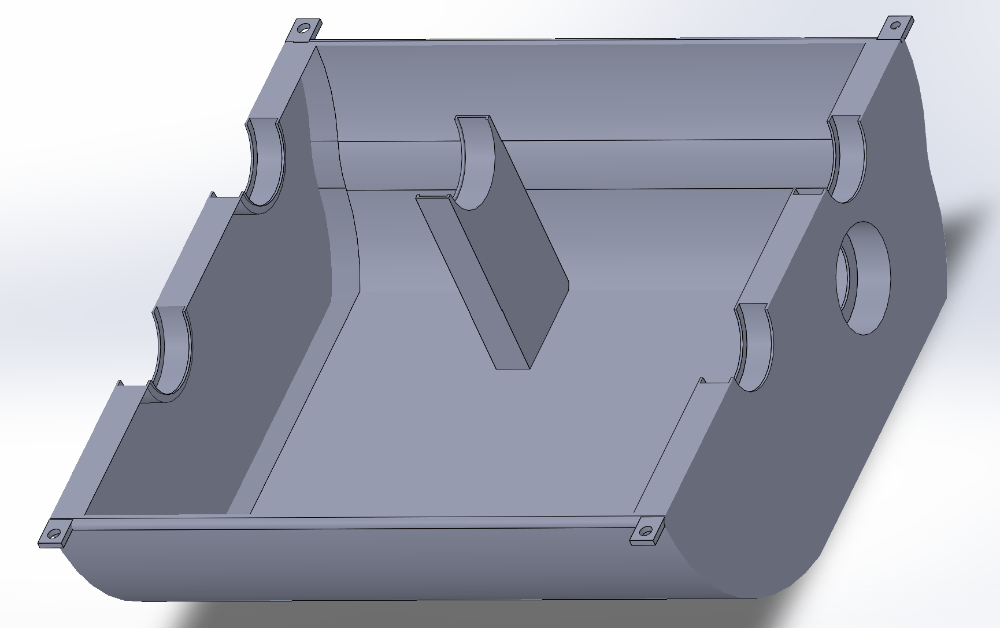

# Five-Speed 3D-Printed Gearbox

A functional constant-mesh gearbox with five forward gears and reverse, designed in SolidWorks and manufactured primarily through FDM 3D printing.

## Project Details

- Five forward gear ratios and one reverse ratio
- 1:1 direct drive in fifth gear
- Constant-mesh spur-gear system
- ABS casing, gears and shafts
- Bearing-supported shaft arrangement
- H-pattern manual shifting mechanism
- Physical assembly, testing and iterative refinement

## Physical Prototype

  
  
   
  
  

## CAD Models

  

  
  
   
  
  

## Manufacturing and Testing

The gearbox components were manufactured primarily from ABS using FDM 3D printing. Parts were assembled and iteratively adjusted to address printing tolerances, warping and component fit.

Functional testing included:

- Engagement of first through fifth gear and reverse
- Input testing at approximately 1000–1300 rpm
- Verification of consistent gear meshing under no-load conditions
- A 30-minute endurance test across all forward gears and reverse
- Inspection for tooth damage, deformation, excessive wear and changes in operation

## CAD Files

- [Assembly files](CAD/Assemblies)
- [Selected SolidWorks part files](CAD/Parts)

> **CAD file note:** These files were selected from the project development process and may represent preliminary or intermediate design stages. Some geometry may differ from the final components manufactured and assembled in the physical prototype. They are provided for portfolio and demonstration purposes rather than as manufacturing-ready release files.
