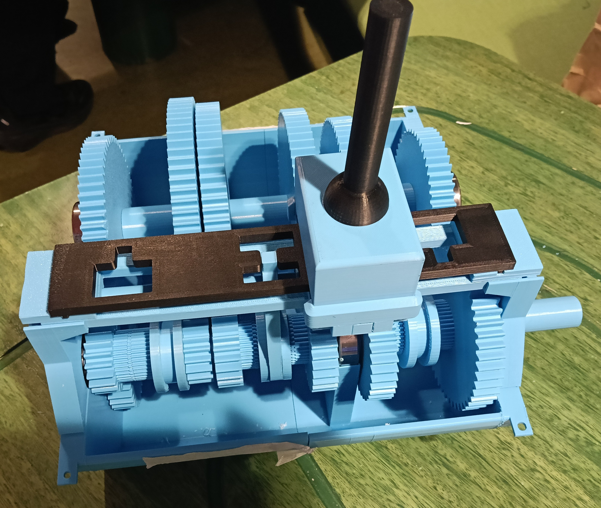
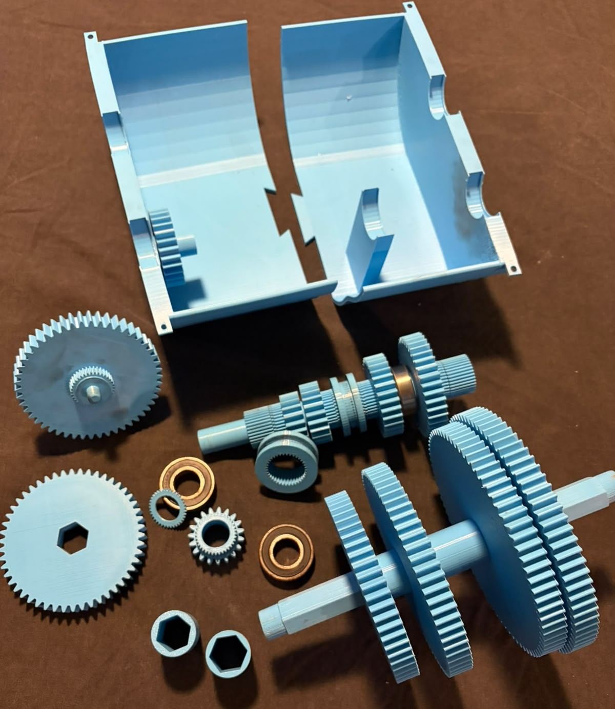
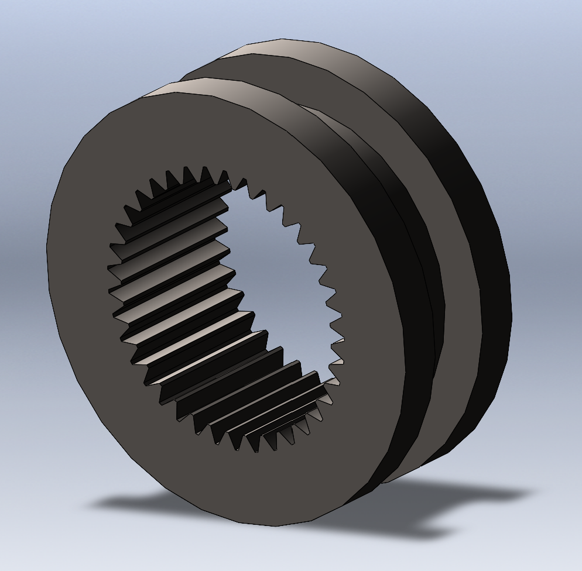

# Five-Speed 3D-Printed Gearbox

A functional constant-mesh gearbox with five forward gears and reverse, designed in SolidWorks and mostly 3D printed in ABS.

## Project Details

- Five forward gears and one reverse gear
- 1:1 direct drive in fifth gear
- Constant-mesh spur gears
- Bearing-supported shafts
- Manual shifting mechanism
- Built, assembled, tested and refined as a physical prototype

## Physical Prototype

  

 
  

## Demonstration Videos

- [Forward gears demonstration](Media/prototype-videos/forward-gears-demonstration.mp4)
- [Reverse gear demonstration](Media/prototype-videos/reverse-gear-demonstration.mp4)

## CAD Models

  

  
  

## Testing

The gearbox was tested through all five forward gears and reverse. It was run at approximately 1000–1300 rpm under no load and later completed a 30-minute endurance test without gear damage or mechanical failure.

## CAD Files

- [Assembly files](CAD/Assemblies)
- [Selected SolidWorks parts](CAD/Parts)

> **CAD file note:** These are selected files from throughout the project and may not be the exact final versions used to manufacture the physical prototype. They are included for portfolio and demonstration purposes, not as production-ready files.
