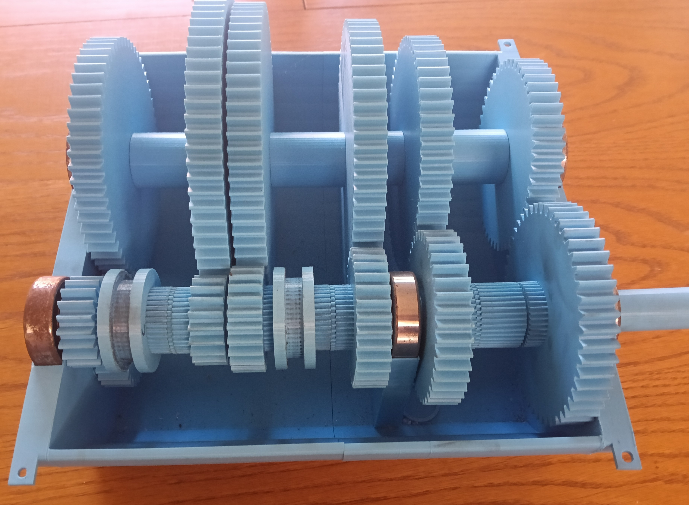
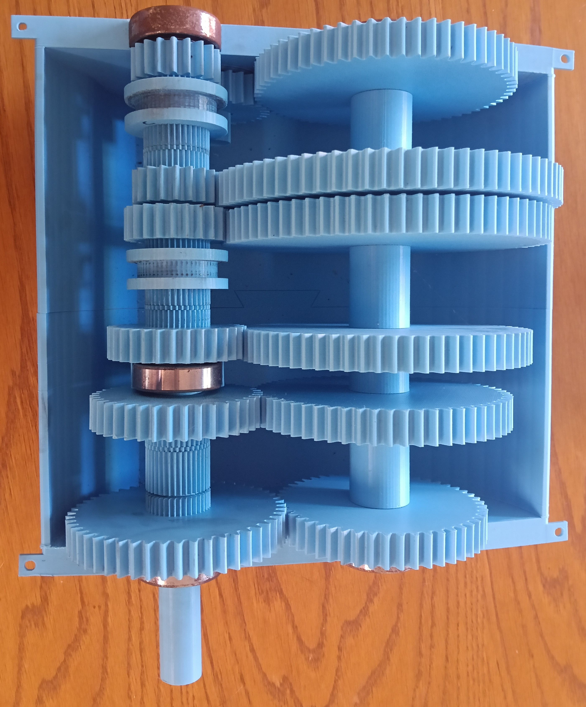

# Five-Speed 3D-Printed Gearbox

A functional constant-mesh gearbox with five forward gears and reverse, designed in SolidWorks and manufactured primarily using FDM 3D printing.

## Project Details

- Five forward gear ratios and one reverse ratio
- 1:1 direct drive in fifth gear
- Constant-mesh spur-gear system
- ABS casing, shafts and gears
- Bearing-supported shafts
- Physical assembly, testing and iterative refinement

## Physical Prototype

  

  
  &nbsp;
  

